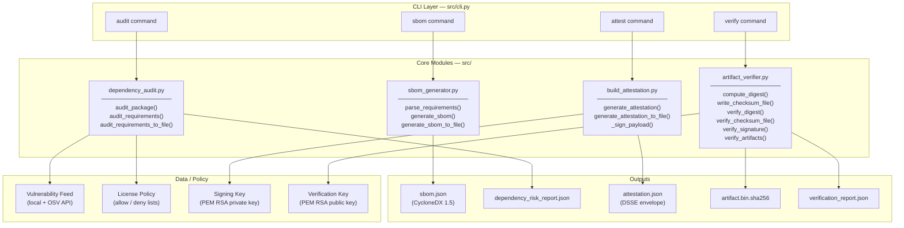

# Component Architecture

This diagram describes the internal component structure of the Supply Chain Integrity Pipeline and the data flows between them.

---

## Module Responsibilities

### `sbom_generator.py`

- Parses `requirements.txt` format lockfiles.
- Maps package names to known SPDX license identifiers.
- Constructs CycloneDX 1.5 JSON with PURL identifiers for every component.
- Assigns BOM-ref identifiers using SHA-256 of the `name==version` string.

### `dependency_audit.py`

- Evaluates each package against a local vulnerability feed keyed by package name.
- Performs version range comparisons (`<`, `<=`, `>=`, `>`, `==`).
- Checks resolved license against allow and deny sets.
- Aggregates findings into an `AuditReport` with overall PASS/FAIL status.

### `build_attestation.py`

- Computes SHA-256 digests of all subject artifacts.
- Constructs an in-toto statement with SLSA provenance predicate.
- Encodes the statement using PAE (Pre-Authentication Encoding).
- Signs with RSA-PSS when a private key is provided; embeds a placeholder otherwise.
- Wraps in a DSSE envelope.

### `artifact_verifier.py`

- Supports SHA-256 and SHA-512 digest computation.
- Reads and writes BSD-style checksum files.
- Verifies artifact digests against expected values or checksum files.
- Verifies RSA-PSS signatures using the `cryptography` library.
- Supports batch verification with JSON report output.

### `cli.py`

- Provides a unified `argparse`-based CLI with four subcommands.
- Translates CLI arguments to module API calls.
- Returns appropriate exit codes for CI gate integration.
