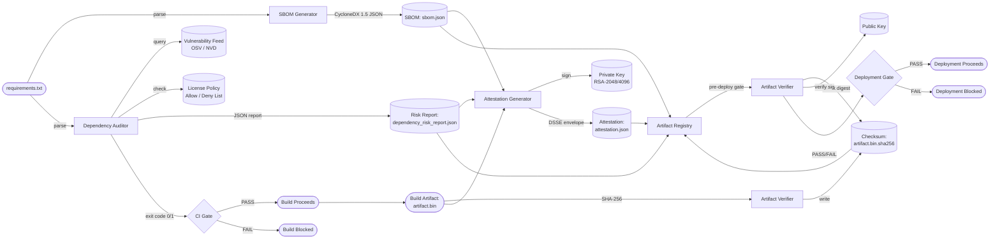

# Data Flow

This diagram shows the complete data flow through the Supply Chain Integrity Pipeline from source code to verified artifact.



---

## Data Flow Steps

| Step | Description | Output |
|---|---|---|
| 1. Parse | `requirements.txt` is parsed to extract `name==version` pairs | In-memory package list |
| 2. SBOM Generation | Each package is enriched with PURL, license, and BOM-ref | `sbom.json` |
| 3. Dependency Audit | Packages are checked against vulnerability feed and license policy | `dependency_risk_report.json` |
| 4. CI Gate | Audit exit code blocks or allows the build to proceed | Exit code 0 or 1 |
| 5. Build | Artifact is produced by the build system | `artifact.bin` |
| 6. Checksum | SHA-256 digest of the artifact is computed and written | `artifact.bin.sha256` |
| 7. Attestation | In-toto statement is generated and signed | `attestation.json` |
| 8. Registry | SBOM, risk report, checksum, and attestation are published | Artifact registry |
| 9. Deployment Gate | Artifact digest is re-verified before deployment | PASS / FAIL |

---

## Artifact Lifecycle

```
Developer Commit
      │
      ▼
CI Build Triggered
      │
      ├─── SBOM Generated ──────────────────────── sbom.json
      │
      ├─── Dependencies Audited ────────────────── dependency_risk_report.json
      │              │
      │         [FAIL → Block]
      │
      ├─── Artifact Built ──────────────────────── artifact.bin
      │
      ├─── Checksum Written ────────────────────── artifact.bin.sha256
      │
      └─── Attestation Generated ───────────────── attestation.json
                      │
                      ▼
              Registry / Evidence Store
                      │
                      ▼
              Pre-Deployment Verification
                      │
              [FAIL → Block Deployment]
```
