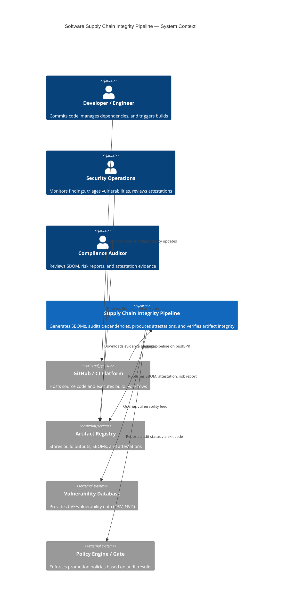

# System Context

This diagram shows the Software Supply Chain Integrity Pipeline in the context of the broader software delivery ecosystem — the external actors, systems, and trust boundaries it interacts with.

---

## Key Actors

| Actor | Role |
|---|---|
| Developer | Initiates builds; responsible for resolving dependency findings |
| CI Platform | Automated execution environment; enforces exit-code-based gates |
| Artifact Registry | Persistent store for build outputs and integrity evidence |
| Vulnerability Database | Authoritative source of CVE data (OSV/NVD in production) |
| Policy Engine | Downstream consumer of audit exit codes and JSON reports |
| Security Operations | Monitors and triages ongoing vulnerability findings |
| Compliance Auditor | Independent review of evidence packages |
