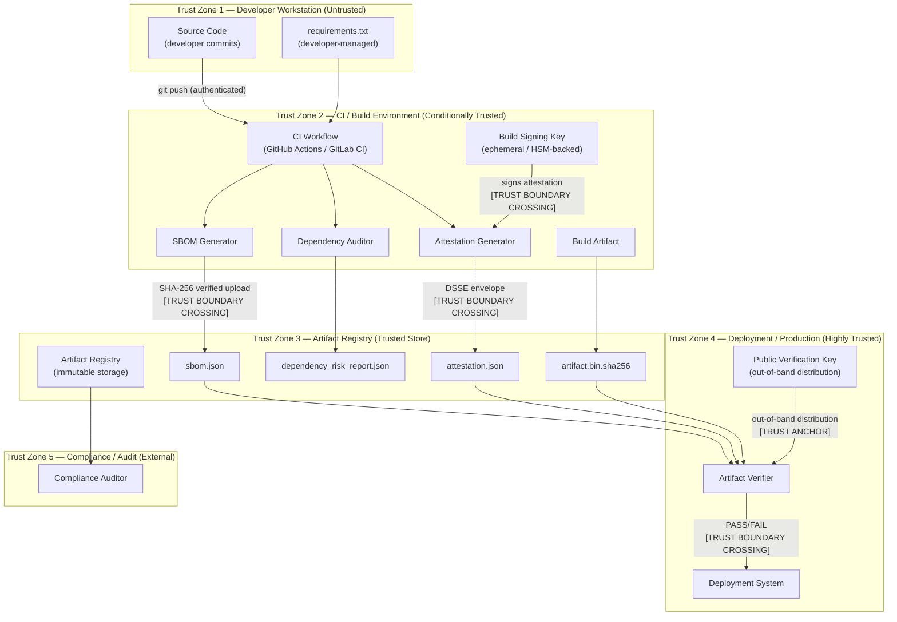

# Trust Boundaries

This diagram describes the trust boundaries within and around the Supply Chain Integrity Pipeline, identifying where cryptographic verification is required and where trust is assumed.

---

## Trust Boundary Analysis

### TB1 → TB2: Developer to CI

- **Risk**: Malicious code or dependency updates injected at commit time.
- **Mitigations**: Branch protection rules, code review requirements, signed commits, CODEOWNERS.
- **Pipeline role**: The CI environment is the first point where integrity checks are enforced automatically.

### TB2 → TB3: CI to Registry

- **Risk**: Man-in-the-middle attack between CI and the artifact registry; artifact substitution.
- **Mitigations**: TLS for all registry communications; artifact upload with content hash verification; immutable artifact storage.
- **Pipeline role**: The `artifact.bin.sha256` checksum file and `attestation.json` are the integrity anchors stored at this boundary.

### TB3 → TB4: Registry to Deployment

- **Risk**: Tampered artifact retrieved from registry; stale or replayed attestation.
- **Mitigations**: The `artifact_verifier.py` re-computes the digest before deployment; the attestation envelope's `buildFinishedOn` timestamp detects replay; the public key is distributed out-of-band (not via the registry itself).
- **Pipeline role**: `verify_checksum_file()` and `verify_signature()` enforce integrity at this crossing.

### Signing Key Trust

- The build signing key (private key) must be stored in a secrets manager or HSM, **never** committed to source control.
- The public verification key is distributed to deployment systems via a separate, trusted channel (e.g., organisation key ring, HashiCorp Vault, AWS KMS).
- Key rotation invalidates past signatures — teams should retain old public keys for verification of archived artifacts.

---

## Security Controls at Trust Boundaries

| Boundary | Control | NIST 800-53 |
|---|---|---|
| Developer → CI | Signed commits, branch protection | CM-3, SA-10 |
| CI → Registry | TLS, content hash upload | SI-7, SC-8 |
| CI Signing | HSM-backed signing key | SC-12, SC-17 |
| Registry → Deploy | Digest re-verification, signature check | SI-7, CM-14 |
| Audit Trail | Immutable attestation envelopes | AU-10, AU-9 |
